# Neuron & Perceptron

🔹 What is a Neuron?

    Think of your brain — it has billions of biological neurons that receive signals, process them, and send output to other neurons.
    An artificial neuron mimics exactly this:

            Inputs (x) → like signals coming in
            Weights (w) → how important each input is
            Bias (b) → a constant that shifts the result
            Activation function → decides whether the neuron "fires" or not
            Output → the final result passed forward

        Formula inside a neuron:
        output = f( x₁·w₁ + x₂·w₂ + x₃·w₃ + b )
        That's it. Inputs × weights → sum → activation function → output.

Perceptron: 

        A Perceptron is the simplest form of a neural network — just one neuron, making a yes/no decision.
        It was invented in 1958 by Frank Rosenblatt.
        How it works:

        Takes inputs, multiplies by weights, adds bias
        If the sum is above a threshold → output = 1 (yes/fire)
        If below → output = 0 (no/don't fire)

        Example: Is this email spam?

        Input 1: Contains word "FREE" → x₁ = 1
        Input 2: From unknown sender → x₂ = 1
Perceptron calculates → "YES, spam!" → output = 1

          Concept            ->      What it means
          
          Neuron             ->      Basic unit — takes inputs, processes, gives output
          Weight (w)         ->      Importance of each input
          Bias (b)           ->      Shifts the output — gives flexibility
          Activation f(x)    ->      Decides if neuron "fires"
          Perceptron         ->      Single neuron doing binary (0/1) decision  

🔹 4 core steps of how a neural network learns:-

Step 1 — y = mx + b (Linear equation / Weighted Sum)

This is what happens inside the neuron before activation.

        y = mx + b
        In neural network language, this becomes:
        z = (w₁·x₁) + (w₂·x₂) + ... + b

        x → your input data (like pixel values, or age, salary etc.)
        w (weight) → how much importance to give each input
        b (bias) → shifts the line up or down, gives flexibility
        z → the raw number that comes out before activation

Think of it like this: you're drawing a line through data. w decides the slope, b decides where the line crosses the y-axis.
But this alone can only solve linear problems (straight lines). Real data is messy — so we need the next step.

Step 2 — Sigmoid (Activation Function)

The output z from step 1 can be any number — like 500, -300, 2.7 — anything.
Sigmoid squishes that number into a range between 0 and 1.

        σ(z) = 1 / (1 + e⁻ᶻ)

        If z is very large → sigmoid ≈ 1
        If z is very small (negative) → sigmoid ≈ 0
        If z = 0 → sigmoid = 0.5

Why do we need this?
        Because neural networks need to make decisions like probabilities — "70% chance this is a cat." Raw numbers like 500 or -300 don't make sense as probabilities. Sigmoid converts them into something meaningful (0 to 1).

Step 3 — Loss Function

Now the network made a prediction (output from sigmoid). But is it correct?

Loss function measures how wrong the prediction is.

Most common one for classification — Binary Cross Entropy:

        Loss = -[ y·log(ŷ) + (1-y)·log(1-ŷ) ]

        y → actual answer (0 or 1)
        ŷ (y-hat) → what the network predicted (between 0 and 1)
        If prediction is close to actual → loss is small
        If prediction is far from actual → loss is large

Simple example:

        Actual: y = 1 (it IS a cat)
        Predicted: ŷ = 0.9 → loss is small ✅
        Predicted: ŷ = 0.1 → loss is huge ❌

The goal of training = minimize this loss.

Step 4 — Optimizer

Now we know the loss. But how do we fix the weights to reduce it?
That's the optimizer's job. Most common one → Gradient Descent.
        w = w - α · (∂Loss/∂w)

Line by line:

       * ∂Loss/∂w → gradient (tells us: if we increase w a little, does loss go up or down?)
       * α (alpha) → learning rate — how big a step we take (too big = overshoot, too small = too slow)
       * w = w - ... → we update the weight in the direction that reduces loss

Think of it like this: you're blindfolded on a hilly surface. You want to reach the lowest point (minimum loss). Gradient descent tells you — "take one step downhill." You keep doing this until you reach the bottom.

                Input data
                ↓
                Step 1: z = wx + b        ← forward pass
                ↓
                Step 2: ŷ = sigmoid(z)    ← activation
                ↓
                Step 3: Loss = how wrong  ← compare with actual
                ↓
                Step 4: Update weights    ← optimizer fixes w and b
                ↓
                Repeat 1000s of times → network learns!

# ANN - Artificial Neural Network

ANN - is same as perceptron but with multiple layers like

Input Layer → Hidden Layer → Output Layer


The Network We'll Use
A simple ANN with:

        - Input layer → 3 neurons (x₁, x₂, x₃)
        - Hidden layer → 4 neurons
        - Output layer → 1 neuron (final prediction)

What is Forward Propagation?

When you pass input data into a neural network, it travels left to right through every layer. Each layer does the same thing:

        z = wx + b       ← linear step
        a = f(z)         ← activation step

The output a of one layer becomes the input x of the next layer. That's it. Repeat till the end.

Step-by-step 

# Forward Propagation

        Step 1 — Input layer
                 Raw data enters. No calculation here. x₁, x₂, x₃ are just your features — like age, salary, height — whatever your dataset has.
        Step 2 — Hidden layer (the real work)
                 Each hidden neuron does exactly 2 things:

                z  = w₁x₁ + w₂x₂ + w₃x₃ + b    ← weighted sum
                a  = σ(z)                         ← activation (sigmoid squishes it to 0-1)
        Step 3 — Output layer
                 Takes outputs from all 4 hidden neurons, does the same thing one more time:

                z_out = w₁a₁ + w₂a₂ + w₃a₃ + w₄a₄ + b_out
                ŷ     = σ(z_out)   ← final prediction (0 to 1)

ŷ (y-hat) = your model's prediction. That's it — forward prop done!

The Full Formula Chain

        Input → [z = wx+b → a = σ(z)] → [z = wa+b → a = σ(z)] → ŷ
                Hidden layer                 Output layer

        Term                  Meaning

        Forward prop      Data flowing left → right through the network
        z                 Weighted sum inside a neuron (wx + b)
        a                 Activation output after sigmoid
        ŷ                 Final prediction of the network 
        Hidden layer      Where the network "thinks" — learns patterns

Numerical example:

Let's say:

                x₁ = 0.5,  w₁ = 0.8

                x₂ = 1.0,  w₂ = -0.3

                x₃ = 0.2,  w₃ = 0.6

                b  = 0.1

Step 1 — weighted sum:

                z = (0.5×0.8) + (1.0×-0.3) + (0.2×0.6) + 0.1

                z = 0.4 + (-0.3) + 0.12 + 0.1

                z = 0.32

Step 2 — sigmoid:

                a = 1 / (1 + e⁻⁰·³²)

                a = 1 / (1 + 0.726)

                a ≈ 0.579

So this neuron outputs 0.579 → passes that to the next layer.

One key thing to remember:
        Every hidden neuron does exactly these 3 things and nothing else:

                z = wx + b — weighted sum

                a = σ(z) — activation

                Pass a forward to next layer

# Backward Propagation

Forward prop makes a prediction. Backprop looks at how wrong it was, and fixes the weights — going backwards, layer by layer.

Why do we need it?

                After forward prop, we have:

                * ŷ = what the network predicted
                * y = actual correct answer
                * Loss = how wrong the prediction was

Now the question is — which weights caused this loss? And by how much should we change each weight?

Backprop answers exactly this using something called the chain rule from calculus.

The Chain Rule:

                If you have a function y = f(z) and z = g(x),
                then the derivative of y with respect to x is:

                dy/dx = dy/dz × dz/dx

That's it. The chain rule just tells you how to combine derivatives of nested functions.

        You just need the intuition. Chain rule says:

                "If A affects B, and B affects C — then how much does A affect C?"

   In our network:

                weights → z → a → Loss

   So to know how much a weight affects Loss, we multiply the small effects together:

                ∂Loss/∂w  =  ∂Loss/∂a  ×  ∂a/∂z  ×  ∂z/∂w

Each ∂ just means "a tiny change in." Read it as: "how does Loss change when we wiggle w"

The 4 Steps of Backprop:

        Step 1 — Compute the loss
                Loss = actual - predicted = y - ŷ

        Step 2 — Gradient at output layer
                How much did the output neuron contribute to the loss?
                        ∂Loss/∂ŷ  =  ŷ - y

        Step 3 — Propagate backwards through sigmoid
                        Sigmoid has a neat derivative:
                        σ'(z) = a × (1 - a)
                So:
                        ∂Loss/∂z  =  (ŷ - y) × a × (1 - a)

        Step 4 — Update the weights
                        Finally, using gradient descent:
                        w_new = w_old - α × ∂Loss/∂w

This is done for every single weight in the network, moving backwards from output → hidden → input.

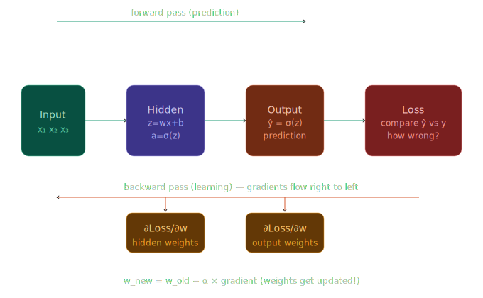   

                Forward pass  →  get ŷ
                                ↓
                        compute Loss
                                ↓
                Backward pass ←  gradients flow back
                                ↓
                        update every weight w
                                ↓
                        repeat 1000s of times
                                ↓
                        network learns! ✅                

One Analogy to lock it in 🎯

Think of a student taking a test:

                * Forward prop = student attempts all answers
                * Loss = teacher marks how many are wrong
                * Backprop = teacher points to each mistake and says "you went wrong here because of this"
                * Weight update = student corrects their understanding
                * Next epoch = student attempts the test again, slightly better

This cycle repeats thousands of times — that's model training.

# Activation Functions

in sigmoid activation function  we face vanishing gradient problem in deep neural networks
        
        
        sigmoid activation function = 1/(1+e^-x)

        derivative of sigmoid activation function = sigmoid(x) * (1 - sigmoid(x))
that give value between 0 and 1 and 
that creates vanishing gradient problem in deep neural networks which does not allow the network to learn properly 

        

# Vanishing gradient descent    

The vanishing gradient problem happens during backpropagation when gradients (the small updates we calculate to
adjust weights) become so tiny that the earlier layers of a deep neural network stop learning.

In other words:

When training deep networks, gradients are multiplied layer by layer.

If these gradients are very small (< 1), multiplying them across many layers makes them shrink toward zero.

This means the first few layers (closer to the input) never get updated properly, so the network fails to learn important
low-level features.        

        like if we have 100 layers in a neural network and the gradient of each layer is 0.5 then the gradient of the first layer will be 0.5^100 which is very small and will not be able to update the weights properly

# Type of Activation Functions

## 1. Linear Activation Function

                f(x) = x

                derivative of linear activation function = 1
        A linear activation function is the simplest type of activation function.
        It basically means:

        f(x) = x
        So, the output is the same as the input. The neuron doesn’t transform the data it
        just passes it forward as it is.

Where do we use it?

        In regression tasks (predicting continuous values like salary, house price, temperature, etc.).
        Usually in the output layer of a neural network, because we don’t want the output to be restricted between 0–1 (like sigmoid) or -1–1
        (like tanh).

        Example:
        If you’re predicting house price, you want outputs like ₹50,00,000 or ₹80,00,000.
        A sigmoid function would squeeze everything between 0 and 1, which won’t make sense here.
                
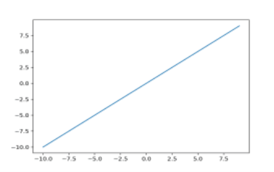

Limitations: 

        If you use linear activation in all layers, the whole network becomes just a linear model, no matter how many layers you add.
        That means it cannot capture complex, non-linear patterns in data.
        That’s why hidden layers use non-linear activations (like ReLU, tanh, sigmoid), but the output layer for regression can be linear.

## 2. Sigmoid Activation Function

The sigmoid function is an S-shaped curve that squashes any real number into a range between 0 and 1.
The formula is:      

                f(x) = 1 / (1 + e⁻ˣ)   
                
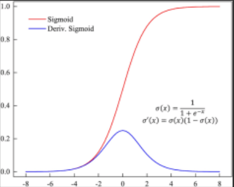

Where do we use it?

                In binary classification problems (e.g., predicting yes/no, disease/no disease, spam/not spam).
                Usually in the output layer when you want a probability as the output.
                Example:
                If the sigmoid outputs 0.85, you can interpret it as 85% chance of having heart disease.

Limitations

                Vanishing gradient problem: for very large or very small inputs, the gradient becomes almost 0, which slows
                learning.
                Not used in hidden layers much nowadays (ReLU is preferred).

## 3. Tanh Activation Function

The tanh function (short for hyperbolic tangent) is another squashing function
like sigmoid, but instead of squeezing values into 0 to 1, it squeezes them into -1
to +1.

        Formula :
                        tanh(x) = (e^x - e^-x) / (e^x + e^-x)

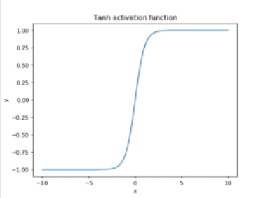

Where do we use it?

                * Often used in hidden layers of nural network

                * Useful when data has both positive and negative values because it centres the
                output around 0 (unlike sigmoid which is centred at 0.5)

Advantages

                * Outputs are zero-centered (good for optimization).

                * Stronger gradients than sigmoid in the range (−1,1), so learning can be faster.

Limitations

                * Still suffers from the vanishing gradient problem when inputs are very large (positive or negative).

                * That’s why in modern deep learning, ReLU is more common in hidden layers.

## 4. ReLU Activation Function
 ReLU stands for Rectified Linear Unit.

It’s super simple: 
                        
                         f(x) = max(0, x)

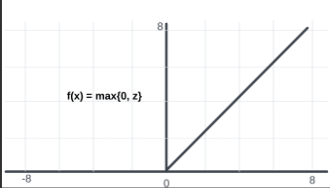

That means:

                         IF input x < 0 -> output = 0

                         IF input x > 0 -> output = x

So it either passes positive values as they are or blocks negative values by turning them into 0.

Where do we use it?

        * Hidden layers of almost all modern deep neural networks.

        * Works really well in CNNs (Convolutional Neural Networks), image recognition, NLP, and many more tasks.

Advantages

        * Very fast and simple to compute.

        * Helps avoid vanishing gradient problem (better than sigmoid/tanh).

        * Makes training deep networks much faster.

Limitations

        * Dying ReLU problem: sometimes neurons get stuck at 0 forever if weights update badly.

        * Not smooth at 0 (not differentiable there, but still works fine in practice).

## 5. Leaky ReLU Activation Function
It’s just like ReLU, but with a small twist.
In ReLU, whenever the input is negative, the output is 0.

Leaky ReLU’s fix:

Instead of giving 0 for negative inputs, it gives a tiny negative value (like 0.01 × input).
This way, the neuron is never completely dead.

Formula:

                f(x) = x if x > 0
                0.01x if x<=0

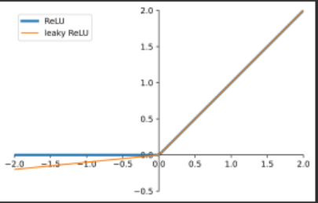

Advantages of Leaky ReLU

        Fixes “Dead Neuron” Problem

                * In normal ReLU, if inputs go negative, the output is always negative neuronsays 0, and sometimes the neuron
                stops learning permanently (dead neuron).

                * Leaky ReLU solves this by allowing a small negative slope, so neurons still update weights.

Computationally Simple

                * Just like ReLU, the function is very easy to compute (no heavy math like exponentials in Sigmoid/Tanh).

Better Gradient Flow

                * Since even negative inputs have a small gradient (e.g., 0.01), the network can continue learning, reducing the
                vanishing gradient issue.

        Works Well in Deep Networks

                * Especially useful in deep neural networks where ReLU may suffer from many dead neurons.

Limitations: small negative slope may bias results, slope value needs tuning

## 6. PReLU Activation Function
PReLU (Parametric Rectified Linear Unit) is an improved version of Leaky ReLU.
In Leaky ReLU, the slope for negative values (like 0.01) is fixed by us. But in PReLU,
that slope is learned automatically by the model during training. This makes it more
flexible and adaptive.

The formula is same as Leaky relu

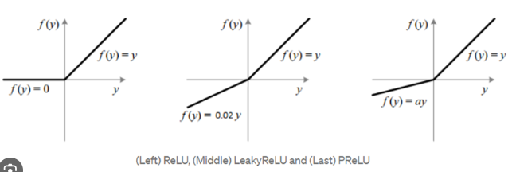

Intuition (Easy Way)

                ReLU: Negative values are killed (output = 0).

                Leaky ReLU: Negative values are given a tiny leak (e.g., 0.01x).

                PReLU: Instead of fixing that leak, the model says “I’ll learn the best leak slope myself.”

Advantages

                1. Fixes dead neurons (like Leaky ReLU).

                2. Adaptive – slope is learned, not fixed.

                3. Better accuracy – often improves CNNs and deep networks.

Limitations

                1. Extra parameters – slope a adds more trainable values.

                2. Risk of overfitting if dataset is small.

                3. Slightly more complex than plain ReLU.

## 7. Swish Activation Function
Swish is a smooth, non-linear activation function introduced by Google
researchers.

It is Defined as :

                f(x) = x * sigmoid(x)

Where σ(x) is the sigmoid function
so basically: Swish = X * Sigmoid(x)

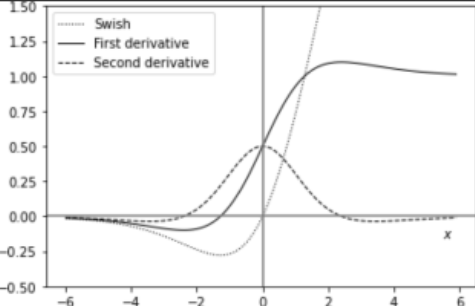

Intuition (Easy Way)

Think of it as ReLU but smoother.

For large positive inputs → output ≈ input (like ReLU).

For large negative inputs → output is small but not strictly zero (like
Leaky ReLU).

Around zero → the curve is smooth, not sharp like ReLU.

This smoothness often makes training deep networks easier.

Advantages

                1. Smooth curve → better gradient flow, avoids sharp jumps like ReLU.

                2. Non-monotonic → can adapt better to complex patterns.

                3. Works well in deep networks (often improves accuracy over ReLU).

Limitations

                1. More computation (needs sigmoid).

                2. Not always better than ReLU (depends on problem).

                3. Slight risk of slower training compared to simple ReLU.

# Usage of activation functions


## Layer 1 — No activation
Raw inputs just pass through. No transformation needed here — you're just feeding data in. Applying activation on raw input would distort it before learning even starts.

## Layer 2 — Pre-ReLU → ReLU

Pre-ReLU = z = wx + b (the weighted sum, before activation)

ReLU = max(0, z) — if z is negative, output is 0. If positive, output is z as-is.

        z = -3  →  ReLU = 0   (dead, ignored)

        z =  5  →  ReLU = 5   (passes through)

Why ReLU? It's fast, simple, and solves the vanishing gradient problem that sigmoid has in deep networks.

## Layer 3 — ReLU / Leaky ReLU / pre-ReLU

ReLU → same as above, kills negatives completely.

Leaky ReLU → small fix to ReLU. Instead of killing negatives, it allows a tiny slope:

        z = -3  →  Leaky ReLU = -3 × 0.01 = -0.03   (small negative, not dead)

        z =  5  →  Leaky ReLU = 5                     (same as ReLU)

Why Leaky? Solves the dying ReLU problem — some neurons in deep networks permanently output 0 and stop learning. Leaky ReLU keeps them alive.

pre-ReLU here means a neuron that computed z = wx + b but hasn't been activated yet — its activation happens next.

## Layer 4 — Output layer activations

This is where the task decides which activation you use:

        Activation                 When to use                           Output 

        LinearRegression           (predict a number)                    Any real number

        Sigmoid                    Binary classification (yes/no)        0 to 1 (probability)

        Softmax                    Multi-class (cat/dog/bird?)           Probabilities summing to 1

Hidden layers  →  

                ReLU (default choice)

                Leaky ReLU (if neurons dying)

Output layer   →  

                Linear   for regression

                Sigmoid   for binary classification

                Softmax   for multi-class classification

# epoch - loss ,accuracy,val_loss,val_accuracy

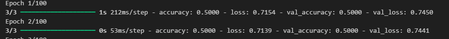

1. loss -

        This is the training loss.

        It tells you how wrong your model’s predictions are on the training set, according to the loss function you chose (in your case: binary cross-entropy).

        Lower is better.

        During training, the model tries to reduce this number by updating weights with gradient descent.

2. accuracy -

        This is the training accuracy.

        It tells you what fraction of training samples the model is correctly predicting.

        Example: If you have 100 samples and the model gets 80 correct → accuracy = 0.80 (80%).

3. val_loss -

        This is the validation loss.

        After generalizing well or just memorizingion set (the split you gave with validation_data=...) and calculates the loss on that unseen data.

        This tells you whether your model is generalizing well or just memorizing the training data.

4. val_accuracy -

        This is the validation accuracy.

        It’s the percentage of correct predictions on the validation set.

        If accuracy is high but val_accuracy is low → your model is probably overfitting (memorizing training but failing on new data).

Where to pay attention

        • loss & accuracy = how well model is doing on training data.

        • val_loss & val_accuracy = how well model is doing on new unseen data.

        Always pay more attention to validation metrics because that shows how the model will behave in the real world.