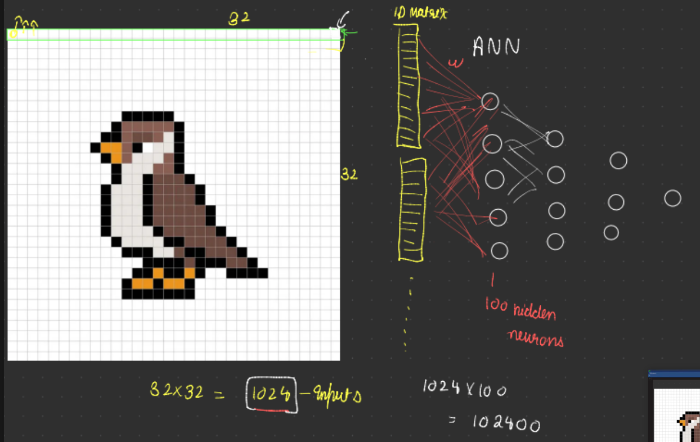
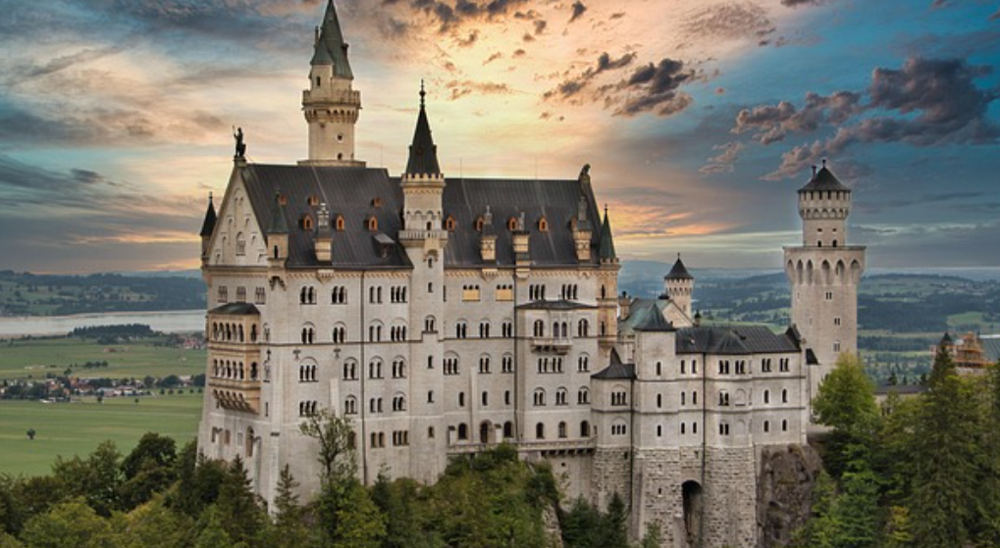
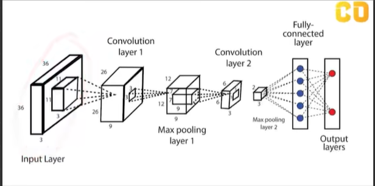
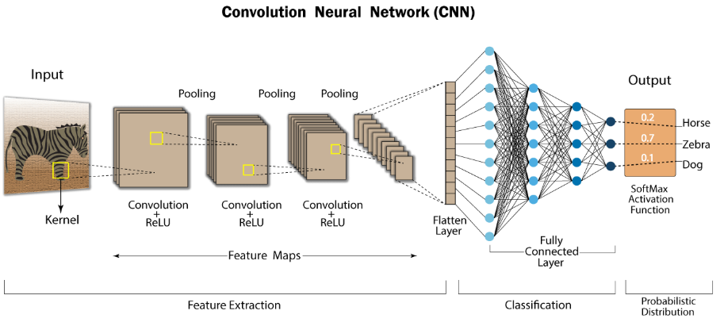
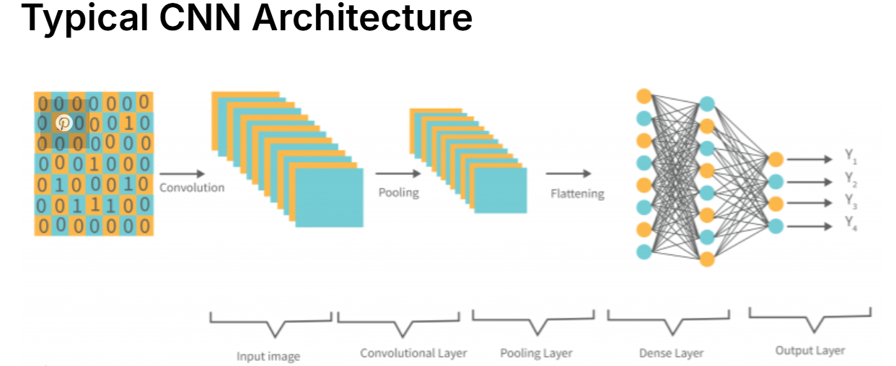
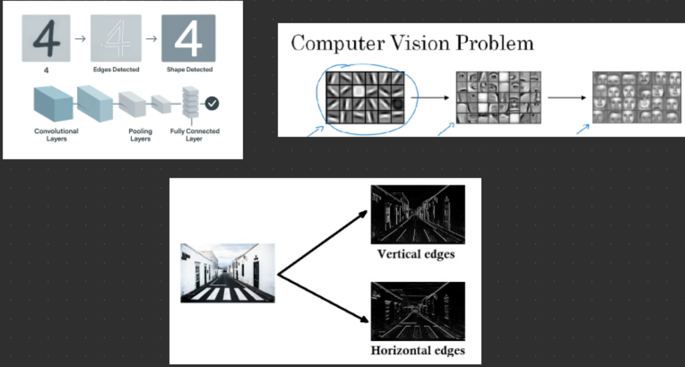
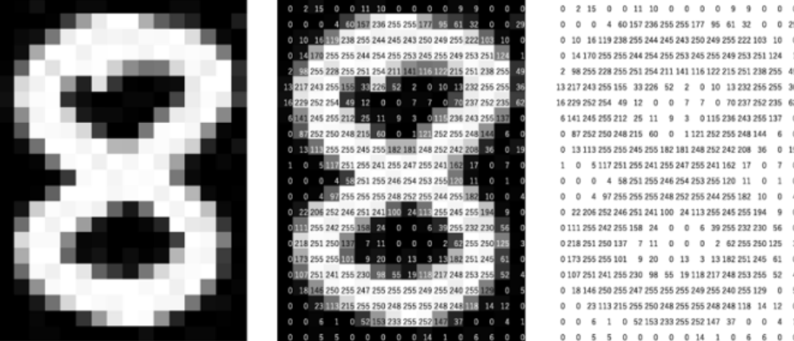
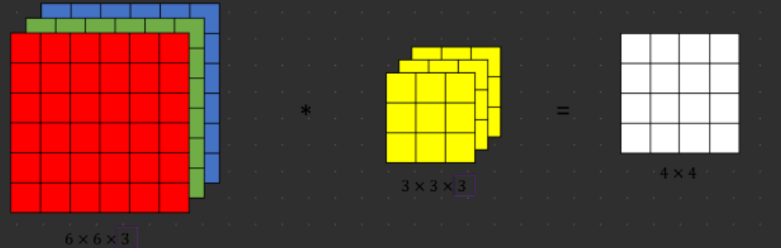
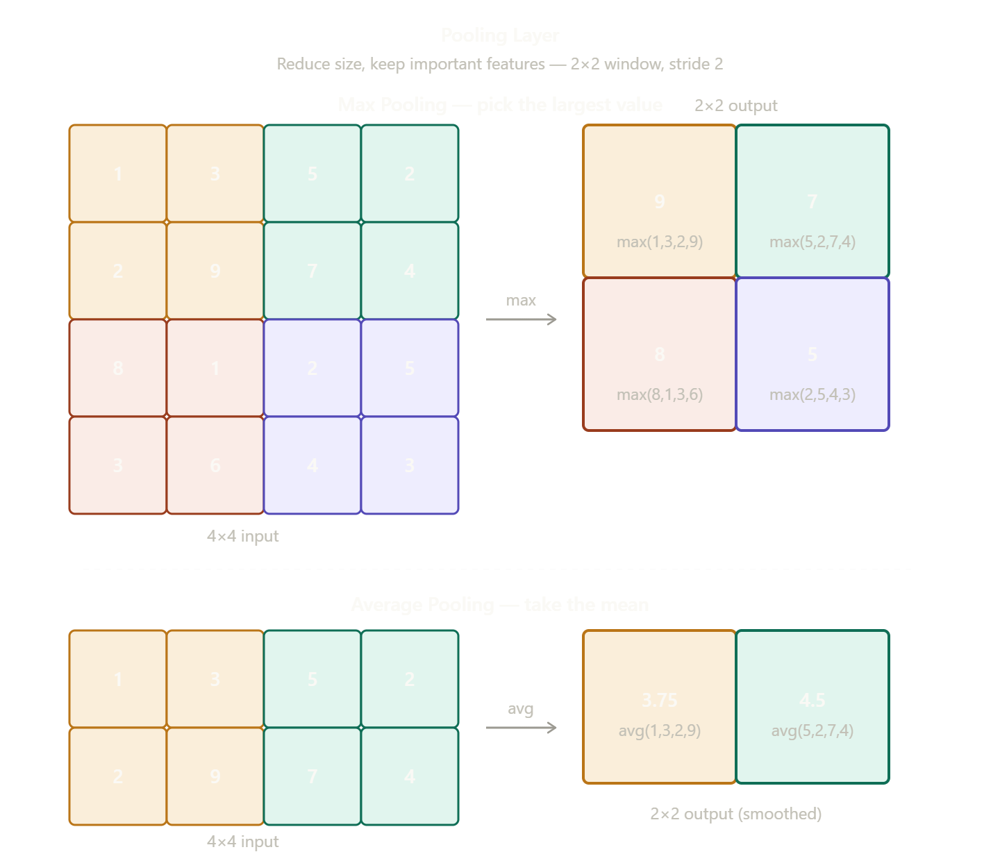

# 🧠 Convolutional Neural Network (CNN)

---

## 📌 What is CNN?

CNN (Convolutional Neural Network) is a specialized type of deep neural network primarily designed for **image processing and computer vision** tasks.

It is inspired by the **human visual cortex** — the way our eyes detect edges, shapes, and objects in layers. Similarly, CNNs learn **hierarchical features** from images, starting from simple edges to complex patterns like faces or objects.

---

## ❓ Why CNN?

Traditional neural networks fail at image tasks because images have **spatial structure** — nearby pixels are related to each other. CNNs are built to **capture these spatial relationships** using convolutional layers.

| Feature | CNN |
|---|---|
| Handles spatial data | ✅ Yes |
| Parameter sharing | ✅ Yes (less parameters) |
| Translation invariance | ✅ Yes |
| Best for images/video | ✅ Yes |

---

## ⚠️ Why NOT ANN for Image Processing?

ANNs (Artificial Neural Networks) treat every pixel as an **independent input**, which causes several problems:

- **Too many parameters** — A 224×224 image = 150,528 pixels. Each connected to every neuron = millions of weights 🤯
- **No spatial awareness** — ANN doesn't understand that nearby pixels are related
- **Overfitting** — So many parameters → model memorizes instead of learning
- **Not translation invariant** — If a cat moves slightly in the image, ANN sees it as a completely different image



> 💡 **CNN solves this** by using shared filters that slide over the image — learning patterns regardless of where they appear.

---
## ❓ What actually is CNN ?



If I ask you “What’s in the picture?”, you don’t try to look at all the
LEGO pieces at once.

    Instead, you:
    First look at small areas maybe a window, a tower, or a door.
    Then you put those pieces together in your mind:
    “Oh, I see windows!”
    “Oh, that looks like a tower!”
    Finally, you say: “Yes, this is a castle!”

That’s exactly how Convolutional Neural Networks (CNNs) work.
They don’t try to understand the whole image at once they look at small
patches and slowly build up the full picture.

---

## 🏗️ CNN Architecture — How It Works??



---

### 1. 🔍 Convolution Layer — *The Detective's Magnifying Glass*

This layer slides a small **filter** (like a 3×3 window) across the image.

- The filter detects **edges, colors, or textures**
- One filter might learn → `"straight lines"`
- Another filter might learn → `"round shapes"`

> 💡 Think of it like a detective scanning tiny parts of a picture for clues — one clue at a time.



---

### 2. 🗜️ Pooling Layer — *The Shortcut*

Once the detective finds details, we don't need every tiny pixel anymore.  
Pooling **keeps only the most important information**.

- Reduces the size of the image (less computation)
- Still preserves the important patterns
- Like **zooming out** — you lose tiny details but still see the big picture



---

### 3. 🔁 More Conv + Pooling Layers — *Building Understanding*

As the network goes **deeper**, it learns more complex things:

| Layer Level | What it learns |
|---|---|
| Early layers | Edges, lines, curves |
| Middle layers | Shapes — eyes, noses, wheels |
| Deeper layers | Full objects — cat, car, castle |

---

### 4. 🧠 Fully Connected Layer — *The Decision Maker*

At the end, CNN **flattens** everything it learned and connects it like a normal ANN.

It then gives probability scores like:

            “70% chance it’s a cat ”
            “20% chance it’s a dog ”
            “10% chance it’s a rabbit ”

Whichever is highest, that’s the answer!


---

## 🔬 What Does Each Layer Actually Detect?

> Let's take a real example — a **Human Face** 🧑

---

### 🟡 Layer 1 — Edges & Lines *(The Sketch Artist)*

The first Conv layer detects the most **basic and raw** features:

- Horizontal, vertical, diagonal **edges**
- Color boundaries (where skin meets hair)
- Basic curves and contrasts

**For a face →** It just sees a rough **outline sketch** — no details yet ✏️

---

### 🟠 Layer 2 — Simple Shapes & Textures *(The Shape Finder)*

Now it **combines edges** to find slightly complex patterns:

- Corners, circles, curves
- Small textures like **skin texture, hair strands**
- Light and shadow boundaries

**For a face →** It starts recognizing **rough shapes** — "there's something round here" 🔵

---

### 🔴 Layer 3 — Face Parts *(The Part Recognizer)*

Now shapes combine to detect **meaningful parts**:

- 👁️ **Eye** → circle + lines + dark center
- 👃 **Nose** → triangular shape + shadow
- 👄 **Lips** → curved edges + color contrast
- 🦴 **Jawline** → long curved edge

**For a face →** CNN can now say *"yeh eye hai, yeh nose hai"*

---

### 🟢 Layer 4+ — Full Object *(The Decision Maker)*

Deep layers **combine all parts** together:

- Eye + Nose + Lips + Face shape = **"This is a Human Face ✅"**
- Even deeper → **"This face looks happy 😊 / sad 😢"**

---

### 🧠 The Big Picture

| Layer | Detects | Example (Face) |
|---|---|---|
| Layer 1 | Edges, lines | Outline of face |
| Layer 2 | Shapes, textures | Skin, hair texture |
| Layer 3 | Face parts | Eyes, nose, lips |
| Layer 4+ | Full object | Human face, expression |

> 💡 **Shallow layers = Simple (edges) → Deep layers = Complex (full objects)**  
> CNN builds understanding from scratch — just like a baby first sees shapes, then learns faces! 👶

---

### Finding the edge with maths



---

## 🔢 How Does a Computer See an Image?

> Before CNN can detect anything — it needs to **read** the image as numbers!

---

### 📷 Image = Matrix of Numbers

Every image is just a **grid of pixel values** to a computer:

- Each pixel has a value between **0 (black) → 255 (white)**
- CNN reads these numbers and finds patterns in them

---

### 🖤 Grayscale Image

A grayscale image has only **1 channel**:

Each pixel = 1 number (0 to 255)
```
0   0   0   255  255  255
0   0   0   255  255  255
0   0   0   255  255  255
```
---
> Left side dark (0s) → Right side bright (255s) = a simple edge!

---

### 🌈 RGB Image



A color image has **3 channels**:

| Channel | Value Range |
|---|---|
| 🔴 Red | 0 – 255 |
| 🟢 Green | 0 – 255 |
| 🔵 Blue | 0 – 255 |

So a color image shape = `Height × Width × 3`

---

### 🔍 Filters — How Edges Are Detected

A **filter (kernel)** is a small matrix (like 3×3) that slides over the image and detects specific patterns.

#### Horizontal Filter:
```
-1  -1  -1
 0   0   0
 1   1   1
```

 → Detects **horizontal edges** (top-bottom contrast)

#### Vertical Filter:
```
-1   0   1
-1   0   1
-1   0   1
``` 
→ Detects **vertical edges** (left-right contrast)

---

### ⚙️ How Filter Works?

Filter slides over the image matrix and does **element-wise multiplication + sum**:

        Image Patch     Filter        Result
        0   0   255     -1  0  1
        0   0   255  ×  -1  0  1   →  High value = Edge detected! ✅
        0   0   255     -1  0  1   
 
> 💡 High output value = strong edge found at that position!

---

### 🧠 Key Takeaway

| Concept | Meaning |
|---|---|
| Pixel value | 0 = black, 255 = white |
| Grayscale | 1 channel (H × W × 1) |
| RGB | 3 channels (H × W × 3) |
| Filter/Kernel | Small matrix that detects patterns |
| High filter output | Edge or feature detected! |

---
---

## 📐 Convolution Output Size — Why 6×6 × 3×3 = 4×4?

---

### 🧮 Formula:

            Output Size = (Input Size - Filter Size) + 1
**Example:**
            Input = 6×6,  Filter = 3×3
            Output = (6 - 3) + 1 = 4×4 ✅   
---

### 👀 Visual — Where Does the Filter Fit?

On a 6×6 image, a 3×3 filter can slide to **4 positions** horizontally and **4 positions** vertically:

            ⬛⬛⬛ . . .     ← position 1
            . ⬛⬛⬛ . .     ← position 2
            . . ⬛⬛⬛ .     ← position 3
            . . . ⬛⬛⬛     ← position 4
So output = **4×4** 🎯

---

### 📊 More Examples

| Input | Filter | Output |
|---|---|---|
| 6×6 | 3×3 | 4×4 |
| 8×8 | 3×3 | 6×6 |
| 8×8 | 5×5 | 4×4 |
| 10×10 | 3×3 | 8×8 |

---

### ⚠️ The Problem

> After every Conv layer image **smaller**!  
> To prevent this → use **Padding** 🛡️

---

# Padding and Strides

---

## 🛡️ Padding — Saving the Image Size

### The Problem
Every time a filter slides over the image, the output gets **smaller**:


    6×6 input + 3×3 filter → 4×4 output  (shrinks!)

After many layers → image becomes **too small** to learn from.


---
### The Solution — Padding
Add a border of **zeros** around the image before applying the filter.



                Original 6×6
                ↓  add 1 layer of zeros around it
                Padded 8×8
                ↓  apply 3×3 filter
                Output 6×6  ← same size as input!

### Formula with Padding

            Output Size = (Input Size - Filter Size + 2 × Padding) / Stride + 1 
| Input | Filter | Padding | Output |
|---|---|---|---|
| 6×6 | 3×3 | 0 | 4×4 |
| 6×6 | 3×3 | 1 | 6×6 |
| 8×8 | 3×3 | 1 | 8×8 |

> 💡 `padding=1` with a `3×3` filter = output size stays the same as input!

---

## 👣 Stride — How Big is Each Step?

Stride = **how many pixels the filter moves** each time it slides.

### Stride = 1 (default)
Filter moves **1 pixel** at a time → slow, detailed, larger output

        [ ][ ][ ] →
        [ ][ ][ ] →
        [ ][ ][ ] → ...

### Stride = 2
Filter **jumps 2 pixels** → faster, smaller output

    [ ][ ][ ] →
    [ ][ ][ ] →        ← skipped the middle!


                Stride = 1                  Stride = 2
        Input     6×6                         6×6
        Filter    3×3                         3×3
        Padding   1                           1
        Output    6×6                         4×4  

### Formula with Stride

          Output = (Input - Filter + 2×Padding) / Stride + 1  
| Input | Filter | Stride | Output |
|---|---|---|---|
| 6×6 | 3×3 | 1 | 4×4 |
| 6×6 | 3×3 | 2 | 2×2 |
| 8×8 | 3×3 | 2 | 3×3 |

> 💡 Bigger stride = smaller output = less computation!

---

### 🧠 Padding vs Stride — Quick Summary

| | Padding | Stride |
|---|---|---|
| What it does | Adds zeros around image | Controls filter jump size |
| Effect on output | Keeps size same | Reduces size |
| When to use | Want to preserve size | Want to downsample fast |
| Default value | 0 or 1 | 1 |

---

---

## 🏊 Pooling Layer — Shrink Smart

After convolution, the feature map is still large.
Pooling **reduces the size** while keeping the most important information.

> Think of it like zooming out — you lose tiny details but the big picture stays clear!

---

### ⚙️ How Pooling Works?

A small window (usually **2×2**) slides over the feature map with **stride 2**.
At each position, it picks one value from the 4 cells.

---

### 1. Max Pooling — Pick the Largest

Takes the **maximum value** from each 2×2 window.

            Input 4×4:          Output 2×2 (Max):
            1  3 | 5  2          9  7
            2  9 | 7  4    →     8  5
            8  1 | 2  5
            3  6 | 4  3

> max(1,3,2,9) = **9** | max(5,2,7,4) = **7**

**Use when:** detecting strong/dominant features like edges, textures, object parts.


Most commonly used in CNNs. ✅

---

#### 2. 🟡 Average Pooling — Take the Mean

Takes the **average** of all values in the window.

                        Input:          Output:
                        1  3 | 5  2      3.75   4.5
                        2  9 | 7  4  →   4.5    3.5
                        8  1 | 2  5
                        3  6 | 4  3


                        Input:          Output:
                        1  3 | 5  2      3.75   4.5
                        2  9 | 7  4  →   4.5    3.5
                        8  1 | 2  5
                        3  6 | 4  3

> avg(1,3,2,9) = **3.75** | avg(5,2,7,4) = **4.5**

**Use when:** you want smoother, less noisy representations.
Good for preserving background info, sometimes used in early layers.

---

#### 3. 🔵 Min Pooling — Pick the Smallest

Takes the **minimum value** from each 2×2 window.

                Input:          Output:
                1  3 | 5  2      1   2
                2  9 | 7  4  →   1   2
                8  1 | 2  5
                3  6 | 4  3

min(1,3,2,9) = **1** | min(5,2,7,4) = **2**

> min(1,3,2,9) = **1** | min(5,2,7,4) = **2**

**Use when:** highlighting dark features, anomalies, or background suppression.
Rare in practice — mostly used in special cases.

---

### 📊 All Three — Quick Comparison

| Type | Operation | Best For | Common? |
|---|---|---|---|
| Max Pooling | Largest value | Edges, textures, dominant features | ✅ Most common |
| Avg Pooling | Mean of values | Smooth representations, background | Moderate |
| Min Pooling | Smallest value | Dark features, anomaly detection | Rare |

---
### 🧠 Formula

Output Size = (Input - Pool Size) / Stride + 1
Example: (4 - 2) / 2 + 1 = 2  →  2×2 output ✅


---




---

## 📐 Flatten Layer — 3D to 1D

### What is Flatten?

After all the Conv and Pooling layers, the output is a **3D feature map**:

        Example: 4 × 4 × 3  (Height × Width × Filters)

But the Fully Connected (ANN) layer needs a **1D vector** as input — it cannot read 3D data!

So **Flatten** simply unrolls the entire 3D structure into one long list of numbers.

---

### How It Works?

        4 × 4 × 3  →  Flatten  →  48 neurons (1D vector)
        (just multiply all dimensions: 4 × 4 × 3 = 48)


No math, no weights — just **reshaping** the data! 📦 → 📋

---

### Real Example

                        Input image:    224 × 224 × 3  (RGB image)
                        After Conv+Pool: 7 × 7 × 512
                        After Flatten:   7 × 7 × 512  =  25,088 neurons  →  goes into FC layer

---

### 🧠 Analogy

> Conv + Pooling layers = **detective collecting clues** (3D, spatial)


> Flatten = **writing all clues in one list** (1D, sequential)


> FC Layer = **boss reads the list and makes decision** 🎯

---

### 📊 Key Points

| | Detail |
|---|---|
| Input | 3D feature map (H × W × Filters) |
| Output | 1D vector (H × W × Filters values) |
| Parameters | None — just reshaping! |
| Purpose | Bridge between Conv layers and FC layer |

---
