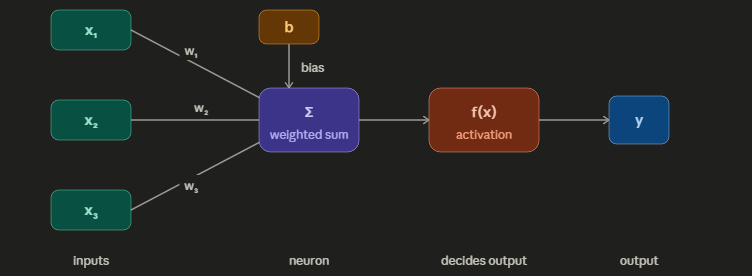

# DL_Clear_Basics

🔹 What is a Neuron?
        Think of your brain — it has billions of biological neurons that receive signals, process them, and send output to other neurons.
        An artificial neuron mimics exactly this:

            Inputs (x) → like signals coming in
            Weights (w) → how important each input is
            Bias (b) → a constant that shifts the result
            Activation function → decides whether the neuron "fires" or not
            Output → the final result passed forward

Perceptron: 
         A Perceptron is the simplest form of a neural network — just one neuron, making a yes/no decision.
        It was invented in 1958 by Frank Rosenblatt.
        How it works:

        Takes inputs, multiplies by weights, adds bias
        If the sum is above a threshold → output = 1 (yes/fire)
        If below → output = 0 (no/don't fire)

        Example: Is this email spam?

        Input 1: Contains word "FREE" → x₁ = 1
        Input 2: From unknown sender → x₂ = 1
Perceptron calculates → "YES, spam!" → output = 1

            