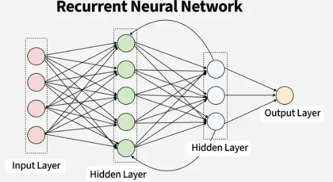
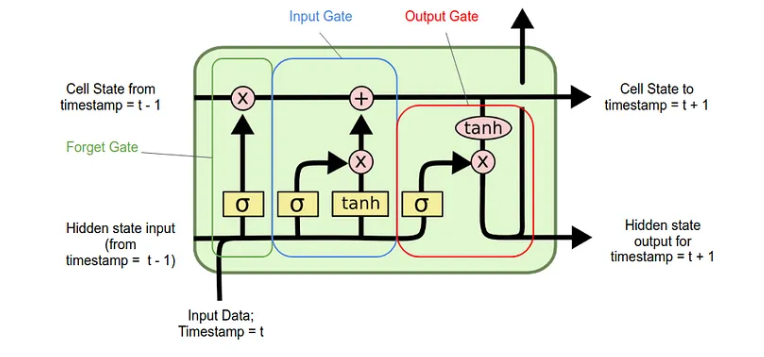
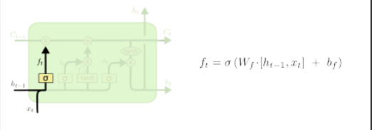
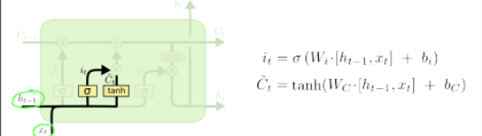
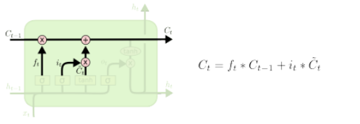
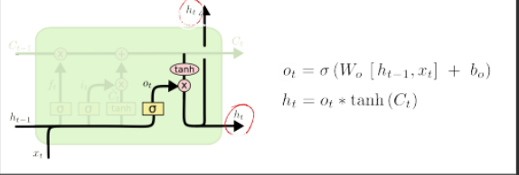

# Recurrent Neural Networks (RNN)

## What is an RNN?

Imagine you're reading this sentence word by word. By the time you reach the word **"it"**, you already remember what came before — so you know what "it" refers to. Your brain doesn't reset after every word. It **carries memory forward.**

A normal neural network (like a plain ANN or CNN) doesn't do this. Every input is treated **independently** — it has no memory of what came before.

**RNN fixes this.** It's a neural network designed for **sequential data** — data where **order matters** and the past affects the future.

---

## Where is RNN used?

| Use Case | Why sequence matters |
|---|---|
| Text generation | Next word depends on previous words |
| Sentiment analysis | Meaning builds across the sentence |
| Speech recognition | Sound depends on surrounding sounds |
| Stock price prediction | Today's price depends on past prices |
| Machine translation | Word order changes meaning |

---

## How is RNN different from ANN?

| ANN | RNN |
|---|---|
| No memory | Has memory (hidden state) |
| Input → Output | Input + Past state → Output |
| Good for images, tabular data | Good for sequences, time series, text |
|Text input size may vary |Text input size must be fixed in a batch |
|Computational Power Required less |Computational Power Required more|
|Semantic meaning is not preserved well |Semantic meaning is preserved well|


---

## The Core Idea — Hidden State

At every time step, RNN does two things:
1. Takes the **current input** (e.g., current word)
2. Takes the **previous hidden state** (memory from past steps)

And produces:
- A **new hidden state** (updated memory)
- An **output**

```
h_t = tanh(W_h * h_(t-1) + W_x * x_t + b)
```

In simple words:
> **New memory = f(old memory + new input)**

---

## Visualizing the Flow

```
x1 → [RNN Cell] → h1
              ↓
x2 → [RNN Cell] → h2
              ↓
x3 → [RNN Cell] → h3 → Output
```

The same cell is **reused at every step** — that's why it's called *recurrent.*

---

## Key Terms to Remember

| Term | Meaning |
|---|---|
| x_t | Input at time step t |
| h_t | Hidden state at time step t (the "memory") |
| W_h, W_x | Weight matrices learned during training |
| tanh | Activation function used in RNN |
| Unrolling | Expanding the RNN across time steps for visualization |

---

## One Line Summary

> RNN is a neural network that has a **memory** — it processes sequences by passing information from one step to the next through a **hidden state.**

---


Got it! Tu chahti hai ki main isko rewrite karun — cleaner, easier to understand, better flow ke saath. Let me make a much better version:


# 🔁 RNN Architecture

---

## 🧠 Why RNN?

Normal neural networks process **one input at a time** — they have no memory.

RNN is special because it has **memory** — it remembers what came before while processing the current input.

This makes it perfect for:
- Text (words depend on previous words)
- Time series (values depend on previous values)
- Speech, music, video

---

## 📥 Step 1 — How Do We Feed Text into RNN?

RNN cannot read words. It only understands **numbers**.

So we first convert text → numbers using **One-Hot Encoding**.

### Our Example Dataset

| Comment | Sentiment |
|---|---|
| you are good | 1 (positive) |
| you are bad | 0 (negative) |
| you are not good | 0 (negative) |

---

## 🔤 Step 2 — One-Hot Encoding

From the 3 sentences above, we get **5 unique words** → vocabulary size = **5**

Each word becomes a vector of size 5, where only **one position is 1** (hot):

```
you  = [1, 0, 0, 0, 0]
are  = [0, 1, 0, 0, 0]
good = [0, 0, 1, 0, 0]
bad  = [0, 0, 0, 1, 0]
not  = [0, 0, 0, 0, 1]
```

So the sentence **"you are good"** becomes:

```
[ [1,0,0,0,0], [0,1,0,0,0], [0,0,1,0,0] ]
   you            are           good
```

---

## 📐 Step 3 — Keras Input Shape

Keras wants input in this exact format:

```
(batch_size, time_steps, input_features)
```

| Term | What it means | Our Example |
|---|---|---|
| `batch_size` | How many sentences at once | 3 sentences |
| `time_steps` | How many words per sentence | 4 words |
| `input_features` | Size of each word vector | 6 (vocab size) |

```
Input shape = (3, 4, 6)
```

---

## ⚙️ Step 4 — Inside One RNN Cell

Think of one RNN cell as a small unit that does **two things**:

1. Takes the **current word** (`x_t`)
2. Takes the **memory from previous step** (`h_(t-1)`)
3. Combines them → produces **new memory** (`h_t`) and **output** (`y_t`)

```
         previous memory
         h_(t-1)
            │
x_t ──► [ RNN Cell ] ──► h_t ──► (passed to next cell)
                │
               y_t  (output of this step)
```

### 🧮 The Math Behind It

```
h_t = tanh( Wh · h_(t-1)  +  Wx · x_t  +  b )
             ↑                  ↑
        memory weight      input weight

y_t = Wy · h_t + by
```

> 💡 Key insight: **Wh and Wx are the same weights at every step** — RNN reuses them.

---

## 📜 Step 5 — Processing a Full Sentence (Unrolled View)

For sentence **"you are good"** (3 words = 3 time steps):

```
  x1(you)      x2(are)      x3(good)
     │             │             │
h0 ►[Cell]► h1 ►[Cell]► h2 ►[Cell]► h3
     │             │             │
    y1            y2            y3
```

- `h0` = initial memory (usually all zeros)
- Same cell is reused 3 times — just drawn separately for clarity
- For **sentiment analysis**, only `y3` (final output) is used

---
## ⚡ Activation Function in RNN Hidden Layer

Every RNN cell has an **activation function** inside the hidden layer.

It is applied while calculating the new hidden state `h_t`.

---

### 🔁 The Formula (Recall)

```
h_t = activation( Wh · h_(t-1)  +  Wx · x_t  +  b )
```

The activation function **wraps the whole calculation** inside the hidden layer.

---

### ✅ Default Activation Function — `tanh`

By default, RNN uses **tanh (Hyperbolic Tangent)** as its activation function.

```
tanh(x) = (eˣ - e⁻ˣ) / (eˣ + e⁻ˣ)
```

| Property | Value |
|---|---|
| Output range | **-1 to +1** |
| Shape | S-shaped curve (like sigmoid) |
| Default in Keras RNN | ✅ Yes |

> 💡 tanh squishes any number into the range **-1 to +1** — this keeps the hidden state values controlled and prevents them from exploding.

---

### 🔁 Why tanh and not ReLU?

| | tanh | ReLU |
|---|---|---|
| Output range | -1 to +1 | 0 to ∞ |
| Centered at zero | ✅ Yes | ❌ No |
| Gradient vanishing | Mild | Less (but explodes in RNN) |
| Default in RNN | ✅ Yes | ❌ Not preferred |

> ReLU can cause **exploding gradients** in RNN because hidden states get passed repeatedly — tanh keeps values bounded.

---

### 🧪 In Keras

```python
from tensorflow.keras.layers import SimpleRNN

# default activation = tanh (you don't need to specify)
model.add(SimpleRNN(units=64))

# same as writing:
model.add(SimpleRNN(units=64, activation='tanh'))
```

---

### 💡 One-Line Summary

> RNN hidden layer uses **tanh by default** — it squishes the hidden state between -1 and +1, keeping memory values stable across time steps.


---

---


## 🗂️ Types of RNN

| Type | Input → Output | Real Use Case |
|---|---|---|
| One-to-One | 1 → 1 | Simple classification |
| One-to-Many | 1 → sequence | Image captioning |
| **Many-to-One** | sequence → 1 | **Sentiment analysis** ✅ |
| Many-to-Many (equal) | sequence → sequence | POS tagging |
| Many-to-Many (unequal) | sequence → sequence | Language translation |
| Stacked RNN | sequence → sequence | Complex NLP tasks |
| Bidirectional RNN | sequence → sequence | NER, Question Answering |

---

## ⚔️ Feed Forward Network vs RNN

| | Feed Forward | RNN |
|---|---|---|
| Memory | ❌ No memory | ✅ Has hidden state |
| Input | Fixed size | Variable length sequence |
| Flow | Input → Output | Input + Past memory → Output |
| Best for | Images, tabular data | Text, speech, time series |

---

## 💡 One-Line Summary

> RNN processes sequences **one step at a time** — at each step it reads the current input AND remembers the past, then passes that memory forward.

---

# ⚠️ Problems with Simple RNN

Simple RNNs were a great starting point, but in practice, they **fail badly on real-world tasks**. Here's why we don't use them much today:

---

## 🧠 The Core Problem — Short Memory

A simple RNN processes sequences step by step and passes a **hidden state** from one step to the next. But this hidden state is very small and gets **overwritten at every step**. So by the time the network reaches the end of a long sentence, it has already **forgotten what was at the beginning**.

> **Example:** In the sentence *"The cat that sat on the mat was hungry"* — by the time RNN reaches *"hungry"*, it has nearly forgotten *"cat"*. But understanding the sentence requires connecting both!

---

## 📉 Vanishing & Exploding Gradients

During **Backpropagation Through Time (BPTT)**, gradients are multiplied repeatedly across many time steps.

| Problem | What Happens | Effect |
|---|---|---|
| **Vanishing Gradient** | Gradients shrink to near zero | Early time steps learn nothing |
| **Exploding Gradient** | Gradients grow uncontrollably | Training becomes unstable / NaN values |

This means simple RNNs **can't learn long-range dependencies** — patterns that span many steps in a sequence.

---

## ✅ The Solution — LSTM & GRU

To fix these problems, two powerful architectures were introduced:

- **LSTM (Long Short-Term Memory)** — uses **3 gates** (forget, input, output) to carefully control what to remember and what to discard
- **GRU (Gated Recurrent Unit)** — a simpler version with **2 gates**, faster to train but similarly powerful

These gates act like a **smart filter** — the network *learns* what information is worth keeping across long sequences.

---

## 💡 In Simple Words

| Model | Memory | Handles Long Sequences? | Training Stability |
|---|---|---|---|
| Simple RNN | ❌ Forgets fast | ❌ No | ❌ Unstable |
| LSTM | ✅ Remembers smartly | ✅ Yes | ✅ Stable |
| GRU | ✅ Remembers smartly | ✅ Yes | ✅ Stable |

> **Bottom line:** RNN gets confused in long sequences. LSTM/GRU remember things smartly — which is why we prefer them in almost all real-world NLP and sequence tasks today.


Sure! Let's learn **LSTM (Long Short-Term Memory)** — one of the most important topics in Deep Learning! 🧠

---

# What problem does LSTM solve?

Before LSTM, we had **RNNs (Recurrent Neural Networks)**. RNNs were great at processing sequences (like text, time series), but they had one big problem:

> **Vanishing Gradient Problem** — when sequences are long, the model "forgets" what happened earlier.

Think of it like this:

> You're reading a book. By chapter 10, you've forgotten what happened in chapter 1. That's what RNN does. 😅

**LSTM fixes this** — it has a special "memory" that decides *what to remember* and *what to forget*.

---


## LSTM Architecture — The 3 Gates

LSTM has a **cell state** (long-term memory) and **3 gates** that control information flow:

| Gate | What it does |
|------|-------------|
| **Forget Gate** | Decides what to throw away from memory |
| **Input Gate** | Decides what new info to store in memory |
| **Output Gate** | Decides what to output at this step |

---

## Simple Analogy 🎒

Imagine you're packing a bag for a trip:

- **Forget Gate** → "Do I still need this? Nope, throw it out." 🗑️
- **Input Gate** → "This is useful, pack it in." 📦
- **Output Gate** → "What do I need *right now* from this bag?" 🎒

---
Let's go **deep into the 3 gates** of LSTM — with full intuition first, then math, then code! 🔥

---

## First, understand the BIG picture

LSTM has two things flowing through it:

| | What it is |
|---|---|
| **Cell State (C)** | Long-term memory — like a notebook 📓 |
| **Hidden State (h)** | Short-term memory — like what's in your head right now 🧠 |

The 3 gates **control what happens** to these two things.

---

## Gate 1 — Forget Gate 🗑️

**Question it asks:** *"What should I delete from my long-term memory?"*

### Analogy:
You're writing a story. The character's name was "Rohit". Now the topic changed to a new character "Priya". Your brain says — *"Forget Rohit now."*

### How it works:
- Takes current input **x** and previous hidden state **h**
- Passes through **sigmoid** → gives value between 0 and 1
- **0 = completely forget**, **1 = completely remember**

```
f = sigmoid(W_f · [h_prev, x] + b_f)
```

Then it **multiplies** with cell state:
```
C = f * C_prev   ← parts of memory get erased


```

---

## Gate 2 — Input Gate 📥

**Question it asks:** *"What new info should I ADD to memory?"*

This gate has **two steps**:

### Step 1 — What to update?
Sigmoid decides *which positions* to update (0 to 1):
```
i = sigmoid(W_i · [h_prev, x] + b_i)
```

### Step 2 — What values to write?
Tanh creates *candidate values* to write (-1 to +1):
```
C̃ = tanh(W_c · [h_prev, x] + b_c)
```

### Final — Update the cell state:
```
C = f*C_prev + i*C̃
```

> Forget gate erases old stuff + Input gate writes new stuff = **Updated memory!**

### Analogy:
You're taking notes in class. Sigmoid says *"write in line 3 and 5"*. Tanh says *"write THIS content"*. Together — new notes added! 📝

---

## Gate 3 — Output Gate 📤


**Question it asks:** *"What should I OUTPUT right now?"*

### Step 1 — Decide what to expose:
```
o = sigmoid(W_o · [h_prev, x] + b_o)
```

### Step 2 — Filter the cell state:
```
h = o * tanh(C)
```

> tanh squishes cell state between -1 and 1, then sigmoid **filters** what to actually output.

### Analogy:
Your notebook (cell state) has 10 pages. But someone asks you a question — you don't read all 10 pages. You only look at the *relevant* page. That's the output gate. 📖

---

## Full Picture Together

```
Input: x (current word/value)
       h_prev (what I said last time)
       C_prev (my full memory)

Step 1: Forget Gate  → what to erase from C_prev
Step 2: Input Gate   → what new info to add
Step 3: Update C     → new memory ready
Step 4: Output Gate  → what to say right now (new h)
```

---

## Visual Flow

```
x, h_prev
    │
    ├──→ Forget Gate (σ) ──→ × C_prev ──────────────────┐
    │                                                     ↓
    ├──→ Input Gate (σ) ──┐                          C (new memory)
    │                      × ──→ + ──────────────────────┘
    ├──→ Tanh ────────────┘          │
    │                                ↓
    └──→ Output Gate (σ) ──→ × tanh(C) ──→ h (output)
```


---

## Summary Table

| Gate | Activation | Controls | Effect |
|------|-----------|----------|--------|
| Forget | Sigmoid | Cell state | Erase old memory |
| Input | Sigmoid + Tanh | Cell state | Write new memory |
| Output | Sigmoid | Hidden state | What to say now |

---
