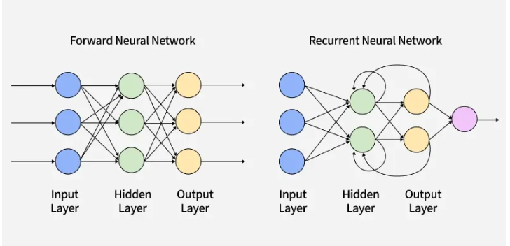

# Recurrent Neural Networks (RNN)

## What is an RNN?

Imagine you're reading this sentence word by word. By the time you reach the word **"it"**, you already remember what came before — so you know what "it" refers to. Your brain doesn't reset after every word. It **carries memory forward.**

A normal neural network (like a plain ANN or CNN) doesn't do this. Every input is treated **independently** — it has no memory of what came before.

**RNN fixes this.** It's a neural network designed for **sequential data** — data where **order matters** and the past affects the future.

---

## Where is RNN used?

| Use Case | Why sequence matters |
|---|---|
| Text generation | Next word depends on previous words |
| Sentiment analysis | Meaning builds across the sentence |
| Speech recognition | Sound depends on surrounding sounds |
| Stock price prediction | Today's price depends on past prices |
| Machine translation | Word order changes meaning |

---

## How is RNN different from ANN?

| ANN | RNN |
|---|---|
| No memory | Has memory (hidden state) |
| Input → Output | Input + Past state → Output |
| Good for images, tabular data | Good for sequences, time series, text |
|Text input size may vary |Text input size must be fixed in a batch |
|Computational Power Required less |Computational Power Required more|
|Semantic meaning is not preserved well |Semantic meaning is preserved well|


---

## The Core Idea — Hidden State

At every time step, RNN does two things:
1. Takes the **current input** (e.g., current word)
2. Takes the **previous hidden state** (memory from past steps)

And produces:
- A **new hidden state** (updated memory)
- An **output**

```
h_t = tanh(W_h * h_(t-1) + W_x * x_t + b)
```

In simple words:
> **New memory = f(old memory + new input)**

---

## Visualizing the Flow

```
x1 → [RNN Cell] → h1
              ↓
x2 → [RNN Cell] → h2
              ↓
x3 → [RNN Cell] → h3 → Output
```

The same cell is **reused at every step** — that's why it's called *recurrent.*

---

## Key Terms to Remember

| Term | Meaning |
|---|---|
| x_t | Input at time step t |
| h_t | Hidden state at time step t (the "memory") |
| W_h, W_x | Weight matrices learned during training |
| tanh | Activation function used in RNN |
| Unrolling | Expanding the RNN across time steps for visualization |

---

## One Line Summary

> RNN is a neural network that has a **memory** — it processes sequences by passing information from one step to the next through a **hidden state.**

---


# RNN Architecture

---

# RNN Architecture

---

## How Data is Fed into RNN

Before feeding text into an RNN, we need to convert words into numbers.  
RNN cannot understand raw text — it only understands numbers.

### Example Dataset

| Comments | Sentiment |
|---|---|
| You are good | 1 |
| You are bad | 0 |
| You are not good | 0 |

---

## Vocabulary & One-Hot Encoding

We have **5 unique words** → vocabulary size = 5

Each word is represented as a vector of size 5:

```
you  = [1, 0, 0, 0, 0]
are  = [0, 1, 0, 0, 0]
good = [0, 0, 1, 0, 0]
bad  = [0, 0, 0, 1, 0]
not  = [0, 0, 0, 0, 1]
```

> This is called **One-Hot Encoding** — only one position is "hot" (1), rest are 0.

---

## Keras Input Shape

Keras expects RNN input in this format:

```
(batch_size, time_steps, input_features)
```

| Term | Meaning | Example |
|---|---|---|
| batch_size | Number of samples per batch | 32 sentences |
| time_steps | Length of sequence (words per sentence) | 3 words |
| input_features | Size of each input vector | 5 (vocab size) |

So for our example:
```
Input shape = (32, 3, 5)
```

---

## Single RNN Cell — What's Inside?

One RNN cell takes:
- **x_t** → current input (current word vector)
- **h_(t-1)** → hidden state from previous step (memory)

And produces:
- **h_t** → new hidden state (updated memory)
- **y_t** → output

```
         h_(t-1)
            ↓
x_t →  [ RNN Cell ]  → h_t → (next cell)
                ↓
               y_t
```

### The Math

```
h_t = tanh(W_h · h_(t-1) + W_x · x_t + b)
y_t = W_y · h_t + b_y
```

> Same weights **(W_h, W_x)** are shared across all time steps.

---

## Unrolled View (Full Sequence)

```
x1 → [Cell] → h1 → [Cell] → h2 → [Cell] → h3
       ↓               ↓               ↓
      y1              y2              y3
```

Each cell is the **same cell reused** — just drawn multiple times for clarity.

---

## Types of RNN Architecture

| Architecture | Input | Output | Example |
|---|---|---|---|
| One to One | Single | Single | Image classification |
| One to Many | Single | Sequence | Image captioning |
| Many to One | Sequence | Single | Sentiment analysis |
| Many to Many (same) | Sequence | Sequence | POS tagging |
| Many to Many (diff) | Sequence | Sequence | Translation |
| Stacked RNN | Sequence | Sequence | Complex NLP |
| Bidirectional RNN | Sequence | Sequence | NER, QA |

---

## Feed Forward vs RNN

| Feed Forward | RNN |
|---|---|
| No memory | Has memory (hidden state) |
| Input → Output | Input + Past state → Output |
| Fixed input size | Variable sequence length |
| Good for tabular/image | Good for text/time series |

---

## One Line Summary

> RNN feeds sequences **step by step** — each step takes current input + past memory, updates the hidden state, and passes it forward.

---




